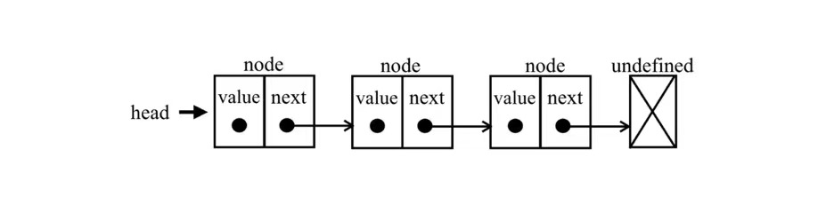

# 数据结构

- [栈]()
- 队列
- 双端队列
- 链表（单项列表）
- 双向链表
- 循环链表
- 有序链表
- 集合

## 栈

### 什么是栈

栈是一种遵循后进先出（LIFO）原则的有序集合，新加元素或待删除的元素都保存在栈的同一端称作栈顶，另一端就叫栈底。新元素都靠近栈顶，就元素靠近栈底。

### 用栈解决问题

- 回溯问题：例如浏览器访问记录
- 进制的相互转换：从十进制转二进制

## 队列

### 什么是队列

队列是一种遵循先进先出（FIFO）原则的有序集合。队列在尾部添加新元素，并从顶部移除元素，新添加的元素必须排在队列的尾部。

## 链表

### 什么是链表

链表是一种使用指针指向下一个元素的有序集合。

