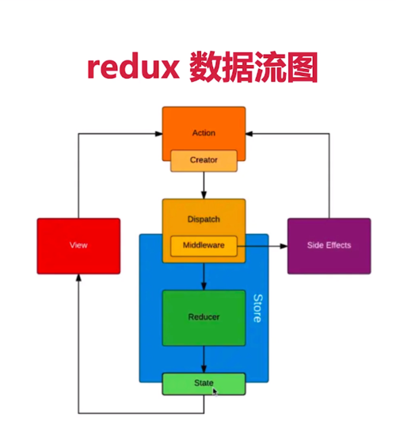
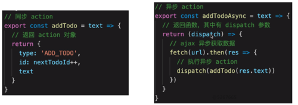

# React class component

- JSX 语法：条件、列表渲染
- 组件间如何通讯
- 常用的生命周期
- React-router
- Context 是什么以及如何应用
- shouleComponentUpdate 用途
- React 为何需要 shouldComponentUpdate
- PureComponents 的作用
- 受控组件和非受控组件
- 如何理解 setState 有时是异步的、有时会被合并、不可变值
- setState 场景题
- refs、Protals
- 高阶组件
- lazy、Suspense 实现懒加载

## 组件间如何通讯

- 父子组件通过 props、ref
- 自定义事件（mitt）
- 状态管理（redux、mobx）和 context

## React-router

- 路由模式（hash 路由、 H5 history 路由）
  - hash 与 history 区别、
  - history 路由原理以及实现
- 路由配置（动态路由、懒加载、嵌套路由）
- 掌握基本使用

## Context 是什么以及如何应用

- react 上下文，父组件向下传递信息
- 可以用于数据共享，一些简单的公共信息如主题、语言，复杂的信息请用状态管理
- class 中要指定 static contextType，函数组件中通过 Consumer、useContext 获取 context

## shouleComponentUpdate 用途

- 性能优化，控制组件何时更新
- 一定要配合不可变值使用，否则会出错

## React 为何需要 shouldComponentUpdate

根据 SCU 的返回值的 boolean 来控制组件是否重新渲染，提供给开发者性能优化的空间，必须与不可变值配合使用，不规范的 state 赋值会导致 SCU 判断 nextState、nextProps 错误，例如父组件中通过

```ts
this.state.count++;
this.setState({ count: this.state.count });
```

将 `this.state.count` 作为子组件 `props` 传入子组件中，在子组件 `SCU` 中判断

```ts
shouldComponentUpdate(nextProps, nextState) {
  reutrn nextProps.count !== props.count
}

```

时结果时 `false`,因为 `props` `是引用类型导致判断出错，处于性能考虑，SCU` 尽量做浅比较
`PureComponent` 是实现了 `SCU` `浅比较的纯组件，PureComponent` 中的 `shouldComponentUpdate()`将跳过所有子组件树的 `prop` 更新，确保所有子组件树也都是纯组件。因此一般情况下 `PureComponent` 用作叶子组件
` React.memo``、useMemo ` 可以在函数组件中实现 `SCU`

## PureComponents 的作用

## 受控组件和非受控组件

## setState 场景题

```tsx
// setState 场景题
componentDidMount() {
  this.setState({ count: this.state.count + 1 });
  console.log(1, this.state.count);
  this.setState({ count: this.state.count + 1 });
  console.log(2, this.state.count);
  this.setState(() => ({
    count: this.state.count + 1
  }), () => {
    console.log(3, this.state.count);
  })
  console.log(4, this.state.count);
  setTimeout(() => {
    this.setState({ count: this.state.count + 1 });
    console.log(5, this.state.count);
  });
  setTimeout(() => {
    this.setState({ count: this.state.count + 1 });
    console.log(6, this.state.count);
  });
}
```

# redux 的使用

## redux 基础知识

- 基本概念
- 单向数据流
- react-redux
- 异步 action
- 中间件

## redux 工作流程

- dispatch(action) 派发
- reducer -> newState
- subscribe 订阅



## redux 中间件


## redux 异步 action

- 常用的异步中间件有 redux-thunk、redux-promise、redux-sage
  

## react-redux 链接 react 与 redux 的高阶函数

- Provider：生产商用来注册 store
- connect：容器组件本质是高阶函数，store.subscribe 订阅 redux state，将 redux state 树中读取部分数据渲染到 react 组件 props 中，connect 做了很多性能优化，避免许多不必要的渲染。定义 mapStateToProps、mapDispatchToProps。
- mapStateToProps、mapDispatchToProps：将自定义后的 state、dispatch 映射到到 react 组件的 props 中
