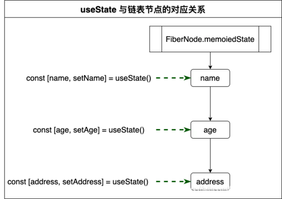

# React Hooks 面试题整理

[React hooks](https://react.docschina.org/docs/hooks-intro.html)
[React hooks 详解](https://blog.csdn.net/kellywong/article/details/106430977)

## 目录

- hooks 的使用规范
- React 加入 Hooks 的意义是什么？为什么 React 要加入 Hooks 这一特性？
- if else 条件判断里使用 hooks 有什么问题
- hooks 闭包的坑有哪些？如何解决
- 常用的 Hooks 有哪些？
- useEffect 为什么有时候会出现无限重复请求的问题
- useEffect 的依赖项里类数组根据什么来判断有没有值变化
- React Hooks api 的原理：
- React Hooks 如何模拟组件生命周期？
- 模拟的生命周期和 class 中的生命周期有什么区别吗？
- Hooks 相比 HOC 和 Render Prop 有哪些优点？
- Function Component 与 Class Component 区别
- useEffect 和 useLayoutEffect 区别？
- useState 和 setState 区别？
- 两者参数对比
- useState 中的第二个参数更新状态和 class 中的 this.setState 区别？
- 用 useState 实现 state 和 setState 功能？
- useReducer 和 redux 区别？
- 如何自定义 HOOK
- Hooks 性能优化
- 怎么在高阶组件里面访问组件实例?

## hooks 的使用规范

- 命名规范 useXxxx
- Hooks 使用规范
  - 只能用于 React 函数组件和自定义 Hooks 中，其他地方不可以
  - 只能用于顶层代码，不能在循环判断或者可能被打断的逻辑中使用
  - eslint 插件 eslint-plugin-react-hooks 可以帮助规范 hooks 的使用
- 关于 hooks 的调用顺序

## React 加入 Hooks 的意义是什么？为什么 React 要加入 Hooks 这一特性？

为了解决一些 component 问题：

- 组件之间的逻辑状态难以复用
- 大型复杂的组件很难拆分
- `Class`语法的使用不友好

比如说：

- 类组件可以访问生命周期，函数组件不能
- 类组件可以定义维护`state`(状态)，函数组件不可以
- 类组件中可以获取到实例化后的`this`,并基于这个`this`做一些操作，而函数组件不可以
- `mixins`:变量作用于来源不清、属性重名、`Mixins`引入过多会导致顺序冲突
- `HOC`和`Render props`：组件嵌套过多，不易渲染调试、会劫持`props`,会有漏洞

有了`Hooks`:

- `Hooks` 让你不必写`class`组件就可以用`state`和其他的`React`特性；
- 也可以编写自己的`hooks`在不同的组件之间复用

## `Hooks`优点:

- 没有破坏性改动：完全可选的。 你无需重写任何已有代码就可以在一些组件中尝试 `Hook`。**100% 向后兼容的**。 `Hook` 不包含任何破坏性改动。
- 更容易复用代码：它通过自定义 hooks 来复用状态，从而解决了类组件逻辑难以复用的问题
- 函数式编程风格：函数式组件、状态保存在运行环境、每个功能都包裹在函数中，整体风格更清爽、优雅
- 代码量少，复用性高
- 更容易拆分

## Hooks 缺点(Hoosk 有哪些坑):

- `hooks` 是 `React 16.8` 的新增特性、以前版本的就别想了
- 状态不同步（闭包带来的坑）:函数的运行是独立的，每个函数都有一份独立的闭包作用域。当我们处理复杂逻辑的时候，经常会碰到“引用不是最新”的问题
- 使用`useState`时候，使用`push，pop，splice`等直接更改数组对象的坑，`push`直接更改数组无法获取到新值，应该采用析构方式原因：`push，pop，splice`是直接修改原数组，`react`会认为`state`并没有发生变化，无法更新)
- `useState` 初始化只初始化一次
- `useEffect` 内部需改 state 时要注意，进行条件判断 setState
- 不要在循环，条件或嵌套函数中调用 Hook，必须始终在 React 函数的顶层使用 Hook。这是因为 React 需要利用调用顺序来正确更新相应的状态，以及调用相应的钩子函数。一旦在循环或条件分支语句中调用 Hook，就容易导致调用顺序的不一致性，从而产生难以预料到的后果

## if else 条件判断里使用 hooks 有什么问题

- `if else`里面不能用`hooks`，`hooks`是有顺序的
- 不能用在`if else` 或者循环里面 还有非顶层的函数内部
- `hooks`在初始化时候是以链表形式存储的，后续更新都是按照这个链表顺序执行的

## hooks 闭包的坑有哪些？如何解决

- 每次 `render` 都有一份新的状态，数据卡在闭包里，捕获了每次 `render` 后的 `state`，也就导致了输出原来的 `state`
  解决：可以通过 `useRef` 来保存 `state`。前文讲过 `ref` 在组件中只存在一份，无论何时使用它的引用都不会产生变化，因此可以来解决闭包引发的问题。

## 常用的 Hooks 有哪些？

- `useState()`状态钩子。为函数组建提供内部状态

- `useContext()`共享钩子。该钩子的作用是，在组件之间共享状态。 可以解决 `react` 逐层通过 `Porps` 传递数据，它接受 `React.createContext()`的返回结果作为参数，使用 `useContext` 将不再需要 `Provider` 和 `Consumer`

- `useReducer()`状态钩子。`Action` 钩子。`useReducer()` 提供了状态管理，其基本原理是通过用户在页面中发起 `action`, 从而通过 `reducer` 方法来改变 `state`, 从而实现页面和状态的通信。使用很像 `redux`

- `useEffect()`副作用钩子。它接收两个参数， 第一个是进行的异步操作， 第二个是数组，用来给出 `Effect` 的依赖项

- `useRef()`获取组件的实例；渲染周期之间共享数据的存储(`state` 不能存储跨渲染周期的数据，因为 `state` 的保存会触发组件重渲染）,`useRef` 传入一个参数 initValue，并创建一个对象`{ current: initValue }`给函数组件使用，在整个生命周期中该对象保持不变

- `useMemo` 和 `useCallback` 可缓存函数的引用或值，`useMemo` 缓存数据，`useCallback` 缓存函数，两者是 Hooks 的常见优化策略，`useCallback(fn,deps)`相当于 `useMemo(()=>fn,deps)`,经常用在下面两种场景:

1. 要保持引用相等；对于组件内部用到的 `object`、`array`、函数等，
2. 用在了其他 Hook 的依赖数组中，或者作为 `props` 传递给了下游组件，应该使用 `useMemo/useCallback`

- `useEffect` 为什么有时候会出现无限重复请求的问题

1. 在 `effect` 里做数据请求未设置依赖参数，没有依赖项 `effect` 会在每次渲染后执行一次，然后在 `effect` 中更新了状态引起渲染并再次触发 effect
2. 所设置的依赖项总是会变

## useEffect 的依赖项里类数组根据什么来判断有没有值变化

- 浅比较

## React Hooks api 的原理：

用链表数据结构来做全局状态保持；判断依赖项决定是否要更新状态等等
`useState` 和 `useReducer` 都是关于状态值的提取和更新， `useState` 是 `useReducer` 的一个简化版,
1、两者的状态值都被挂载在组件实例对象 `FiberNode` 的 `memoizedState` 属性中

2、两者保存状态值的数据结构完全不同；类组件是直接把 state 属性中挂载的这个开发者自定义的对象给保存到 `memoizedState` 属性中；而 `React Hooks` 是用链表来保存状态的， `memoizedState` 属性保存的实际上是这个链表的头指针。

```ts
//链表的节点--Hook 对象 react-reconciler/src/ReactFiberHooks.js
export type Hook={
  memoizedState:any,//最新的状态值
  baseState:any,//初始状态值，如`useState(0)`,则初始值为 0
  baseUpdate:Update<any,any>|null,
  queue:UpdateQueue<any,any> | null,//临时保存对状态值的操作，更准确来说是一个链表数据结构中的一个指针
  next:Hook | null，//指向下一个链表节点
}
```



## React Hooks 如何模拟组件生命周期？

- Hooks 模拟 constructor

```ts
constructor(){
  super()
  this.state={count:0}
}
//Hooks 模拟 constructor
const [count setCount]=useState(0)
```

- Hooks 模拟 componentDidMount

```ts
componentDidMount(){
  console.log('I am mounted')
}
//Hooks 模拟 componentDidMount
useEffect(()=>{
  console.log('mounted')
},[])
//useEffect 拥有两个参数，第一个参数作为回调函数会在浏览器布局和绘制完成后调用，因此它不会阻碍浏览器的渲染进程，第二个参数是一个数组，也是依赖项
//1、当依赖列表存在并有值，如果列表中的任何值发生更改，则每次渲染后都会触发回调
//2、当依赖列不存在时，每次渲染后都会触发回调
//3、当依赖列是一个空列表时，回调只会被触发一次，类似于 componentDidMount
```

- Hooks 模拟 shouldComponentUpdate

```ts
shouldComponentUpdate(nextProps,nextState){
  console.log('shouldComponentUpdate')
  return true //更新组件 反之不更新
}
// React.memo 包裹一个组件来对它的 props 进行浅比较,但这不是一个 hooks，因为它的写法和 hooks 不同，其实 React.memo 等效于 PureComponent,但它只比较 props

// 模拟 shouldComponentUpdate
const MyComponent=React.memo(
  Component,
  (prevProps,nextProps)=>nextProps.count!==preProps.count
)
```

- Hooks 模拟 componentDidUpdate

```ts
componentDidMount() {console.log('mounted or updated');}
componentDidUpate(){console.log('mounted or updated')}
// Hooks 模拟 componentDidUpdate
useEffect(()=>console.log('mounted or updated'))
// 这里的回调函数会在每次渲染后调用，因此不仅可以访问 componentDidUpdate,还可以访问 componentDidMount,如果只想模拟 componentDidUpdate,我们可以这样来实现
// useRef 在组件中创建“实例变量”，它作为一个标志来指示组件是否处于挂载或更新阶段。当组件更新完成后在会执行 else 里面的内容，以此来单独模拟 componentDidUpdate
const mounted=useRef()
useEffect(()=>{
  if(!mounted.current){
    mounted.current=true
  }else{
    console.log('I am didUpdate')
  }
})
```

- Hooks 模拟 componentWillUnmount

```ts
componentWillUnmount(){
  console.log('will unmount')
}
//hooks
useEffect(()=>{
//此处并不同于 willUnMount porps 发生变化即更新，也会执行结束监听
//准确的说：返回的函数会在下一次 effect 执行之前，被执行
  return ()=>{
    console.log('will unmount')
  }
},[])
//当在 useEffect 的回调函数中返回一个函数时，这个函数会在组件卸载前被调用。我们可以在这里清除定时器或事件监听器。
```

## 模拟的生命周期和 class 中的生命周期有什么区别吗？

- 默认的 `useEffect（不带[]）`中 `return` 的清理函数，它和 `componentWillUnmount` 有本质区别的，默认情况下 `return`，在每次 `useEffect` 执行前都会执行，并不是只有组件卸载的时候执行。

- `useEffect` 在副作用结束之后，**会延迟一段时间执行，并非同步执行**，和 `compontDidMount` 有本质区别。遇到 dom 操作，最好使用 `useLayoutEffect`。

**hooks 模拟的生命周期与 class 中的生命周期不尽相同，我们在使用时，还是需要思考业务场景下那种方式最适合。**

## Hooks 相比 HOC 和 Render Prop 有哪些优点？

- `hoc` 和 `render prop` 都是一种开发模式，将复用逻辑提升到父组件，容易嵌套过多，过度包装
- `hooks` 是 `react` 的 `api` 模式，将复用逻辑取到组件顶层，而不是强行提升到父组件中。这样就能够避免 `HOC` 和 `Render Props` 带来的「嵌套地域」

## Function Component 与 Class Component 区别

- 对于 class component 来说：

  - 首先 state 是不可变(Immutable),setState 后生成一个全新的 state 引用
  - 但 class com 通过 this.state 方式读取 state，所以每次代码执行都会拿到最新的 state 引用

- 对于 function component 来说：
  - useState 产生的数据也是不可变 Immutable 的，通过数组第二个参数 Set 一个新值后，原来的值在下次渲染时会形成一个新的引用。
  - 但它 state 没有通过 this.的方式读取，每次执行都读取当时渲染闭包环境的数据，虽然最新的值跟着最新的渲染变了，但旧的渲染里，状态依然是旧值

1、原理：function 组件能捕获渲染的值(captaure the rendered values),读取渲染闭包内的数据，而 class 组件在 react 通过 this.的方式读取，this 是可变的，所以总能获取最新的 props

2、保存状态：Class 把 state 属性挂载的对象保存到 memoizedState 属性中，而 Function 是用链表来保存状态的，memoizedState 属性保存是链表的头指针

## useEffect 和 useLayoutEffect 区别？

1、useEffect 是 render 结束后，callback 函数执行，但是不会阻断浏览器的渲染，算是某种异步的方式吧。但是 class 的 componentDidMount 和 componentDidUpdate 是同步的,在 render 结束后就运行,useEffect 在大部分场景下都比 class 的方式性能更好.

2、useLayoutEffect 是用在处理 DOM 的时候,当你的 useEffect 里面的操作需要处理 DOM,并且会改变页面的样式,就需要用这个,否则可能会出现出现闪屏问题, useLayoutEffect 里面的 callback 函数会在 DOM 更新完成后立即执行,但是会在浏览器进行任何绘制之前运行完成,阻塞了浏览器的绘制

## useState 和 setState 区别？

```ts
//setState
this.setState({ count: this.state.count + 1 }, () => {
  console.log(this.state.count); //通过回调函数监听到最新的值
});

//useState
const [count, setCount] = useState(0);
setCount(1);
useEffect(() => {
  console.log(count); //通过 useEffect 监听最新的值
}, [count]);
```

1、setState 是通过回调函数来获取更新的 state，useState 是通过 useEffect() 来获取最新的 state
2、二者第一个参数都可以传入函数
3、setState()可以在第 2 个参数传入回调，useState()没有第 2 个参数
4、setState()自动具备浅合并功能，useState()更新引用需要手动浅合并

两者参数对比

```ts
setState(updater, [, callback]);
// updater:object/function - 用于更新数据
// callback:function - 用于获取更新后最新的 state 值
useState(initState);
const [state, setState] = useState(initState);
// state:状态
// setState(updater): 修改状态的方法
// updater:object/function - 用于更新数据
// initState : 状态的初始值
```

## useState 第二个返回值更新状态和 class 中的 this.setState 区别？

- useState 通过数组第二个参数 Set 一个新值后，新值会形成一个新的引用，捕获当时渲染闭包里的数据 State

- setState 是通过 this.state 的读取 state,每次代码执行都会拿到最新的 state 引用

## 用 useState 实现 state 和 setState 功能？

```ts
export const useXState = (initState) => {
  const [state, setState] = useState(initState);
  let isUpdate = useRef();
  const setXState = (newState, cb) => {
    setState((prev) => {
      isUpdate.current = cb;
      return typeof state === "function" ? newState(prev) : newState;
    });
  };
  useEffect(() => {
    // useRef 的特性来作为标识区分是挂载还是更新，当执行 setXstate 时，会传入和 setState 一模一样的参数，并且将回调赋值给 useRef 的 current 属性，
    // 这样在更新完成时，我们手动调用 current 即可实现更新后的回调这一功能
    if (isUpdate.current) {
      isUpdate.current();
    }
    return () => {
      isUpdate.current = undefined;
    };
  }, [state]);
  return [state, setXState];
};
```

## useReducer 和 redux 区别？

- useReducer() 提供了状态管理，其基本原理是通过用户在页面中发起 action, 从而通过 reducer 方法来改变 state, 从而实现页面和状态的通信,使用很像 redux
- useReducer 是 useState 的代替方案，用于 state 复杂变化
- useReducer 是单个组件状态管理，组价通讯还需要 props
- redux 是全局的状态管理，多组件共享数据

## 如何自定义 Hook

```ts
import { useState, useEffect } from "react";

function useNum(friendID) {
  const [num, setNum] = useState(0);

  useEffect(() => {
    function listener(status) {
      setNum(status);
    }

    mitt.on("xxx", listener);
    return () => {
      mitt.off("xxx", listener);
    };
  }, [num]);

  return [num];
}
```

## Hooks 性能优化

- useMemo 缓存数据
- useCallback 缓存函数

## 怎么在高阶组件里面访问组件实例?

1、属性代理。高阶组件通过包裹的 React 组件来操作 props，更改 props，可以对传递的包裹组件的 WrappedComponent 的 props 进行控制

2、通过 refs 获取组件实例
