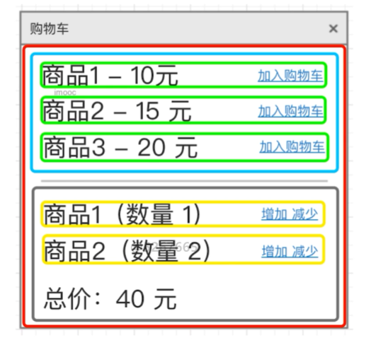

# 组件设计场景题

为什么要考察组件和状态设计

- 框架（Vue React）的使用（和高级特性）是必要条件
- 是否能独立负责项目，考察设计能力

## 组件和状态设计

考察重点：

- 数据驱动视图
- 状态：数据结构设计（React-state，Vue-data）
  - 用数据描述所有内容
  - 数据要结构化，易于程序操作
  - 数据要可扩展，以便增加新的功能
- 视图：组件结构和拆分
  - 从功能上拆分层次
  - 尽量让组件原子化
  - 容器组件（只管理数据）和 UI 组件（只显示视图）

## 面试题

### React 设计 todoList（组件结构，react state 数据结构）

原型


state 数据结构设计

```js
this.state = {
  list: [
    {
      id: 1,
      title: "",
      checked: false,
      completed: false,
    },
  ],
};
```

组件（视图）设计


### Vue 设计购物车（组件结构，vue data 数据结构）

原型


data 数据结构设计

- 要考虑数据的可扩展性：购物车通过 id 获取商品信息（title、price）


组件（视图）设计


