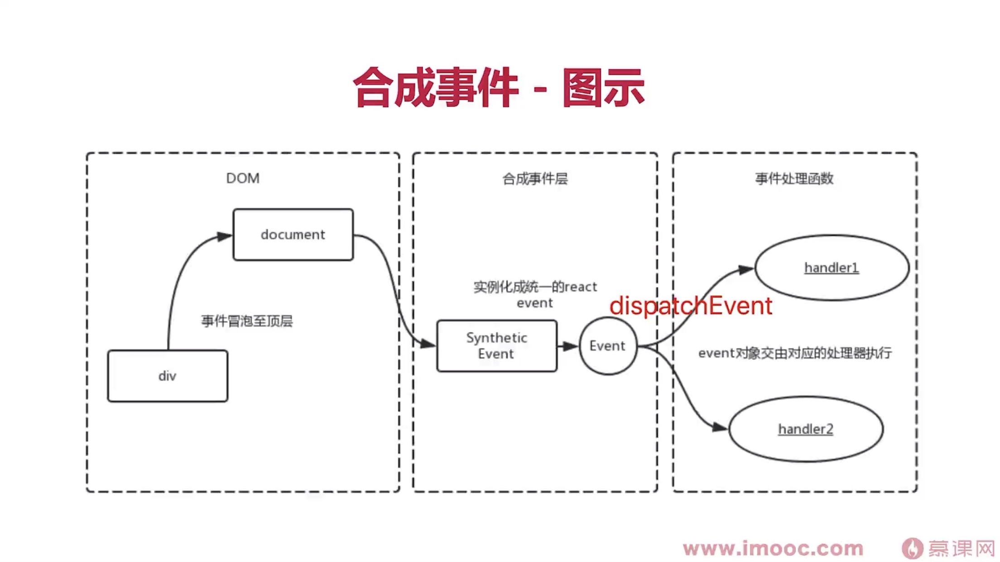

# React 原理

- 函数式编程
- vdom 和 diff
- JSX 本质
- 合成事件
- setState 更新机制、batchUpdate 机制、transaction 事务机制
- 组件渲染过程
- 前端路由
- Fiber
- 更新流程：Reconciliation（更新） 和 commit（提交）

## JSX 本质

- React.createElement 返回 vnode
- 第一个参数可能是组件也可能是 html tag，第二个参数是 props，第三个参数是 children 数组或者平铺的 children
- 组件名必须是大写，React 在编译时区分 html tag

## 合成事件

1. React 合成事件

- 所有事件都挂载到 document 上，v17 后挂载到 root element 上，有利于多个 React 版本共存，如微前端
- event 不是原生的，是 SyntheticEvent 合成事件对象，event.target 当前元素触发的事件，event.currentTarget，event.nativeEvent 是原生的事件对象

2. 合成事件派发流程图

3. 为何要合成事件机制

- 更好的兼容性和跨平台
- 挂在到 document 减少内存消耗，避免频繁解绑
- 方便事件的统一管理如 trancation 事务机制

## setState 更新机制、batchUpdate 机制、transacton 事务机制

参考：https://blog.csdn.net/qq_39207948/article/details/113803273?utm_source=app&app_version=4.17.0
