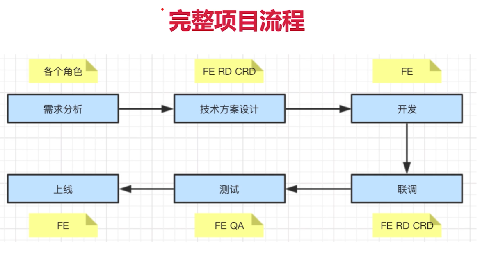

# 项目设计

## 项目流程

- 项目分多人、多角色参与
- 项目分多阶段
- 项目需要设计和只想

## 为何考察项目流程

- 确认你真正参与过实际项目
- 确认你能真正解决项目的问题
- 看你能够独立承担器一个项目

## 项目面试题

- PM 想在项目开发过程中增加需求，该怎么办
  - 不能拒绝，走需求变更流程即可
  - 如果公司有规定则按规定走流程
  - 否则发起项目组和 leader 的评审，重新评估排期
- 项目即将延期该怎么办
  - 先沟通，跟项目负责人报备，项目负责人可能有其他方法解决
- 你将如何保证项目质量

针对上面的面试题，需要了解一下内容

### 如何讲解

- 项目的所有角色
  - PM 产品经理
  - UE 视觉设计师
  - FE 前端开发
  - RD 后端开发
  - CRD 移动端开发
  - QA 测试人员
- 项目的全流程
  - stage1：需求分析
    - 了解背景
    - 质疑需求是否合理
    - 需求是否闭环
    - 开发难度如何
    - 是否需要其他支持
    - 不要急于给排期
  - stage2：技术方案设计
    - 求简，不过度设计
    - 产出文档
    - 找准设计重点
    - 组内评审
    - 和 RD CRD 沟通
    - 发出会议结论
  - stage3：开发（如何保证你的开发质量，开发质量包括开发工期、代码质量）
    - 如何反馈排期：预留 buffer、考虑并行工作、考虑协同人的排期
    - 符合开发规范
    - 写出开发文档
    - 及时单元测试
    - Mock API
    - code review
  - stage4：联调
    - 和 RD CRD 技术联调
    - 让 UE 确定视觉效果
    - 让 PM 确定产品功能
  - stage5：测试
    - 提测发邮件，抄送项目组
    - 测试问题要详细记录（禅道或者多人协作文档）
    - 有问题及时沟通，QA 和 FE 天生信息不对称
  - stage6：上线
    - 上线发邮件
    - 上线之后及时通知 QA 回归测试
    - 上线之后及时通知 PM 和项目组
    - 如有问题，及时回滚，先止损在排查问题

- 各个阶段中的常见问题

- 项目沟通
  - 多人协作，沟通是最重要的事情
  - 每日沟通（如展会），有事说事，无事报平安
  - 及时识别风险，及时汇报
