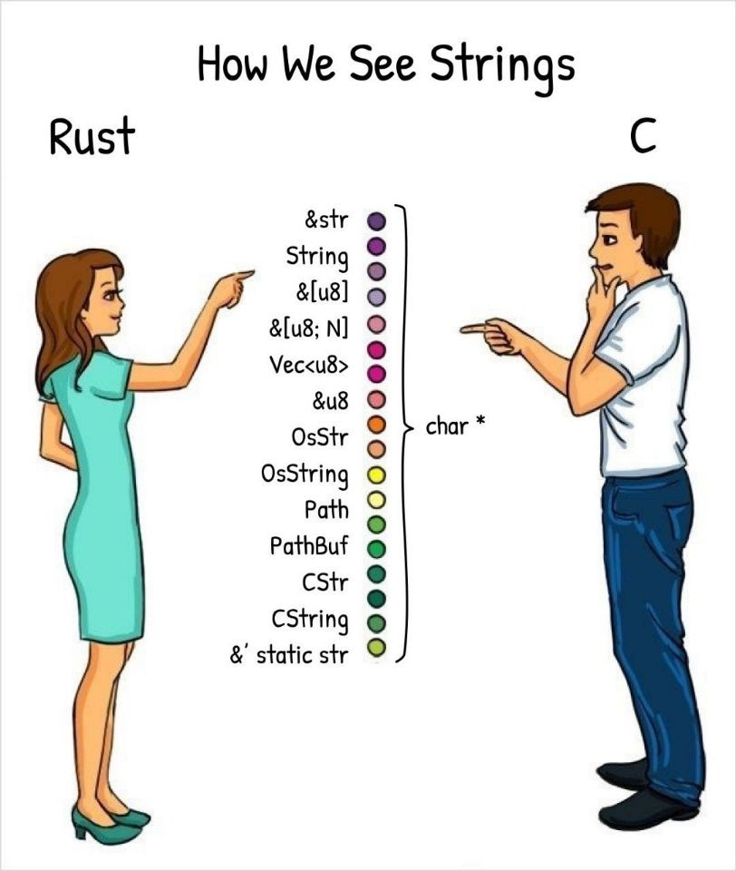

# 字符串类型 str, &str 与 String 的区分

Rust 里表示"字符串"有多种方式, 你可能已经见过 str, &str 与 String, 但它们之间有什么区别? 如果我想使用"字符串"类型, 我应当如何使用?


```rust
fn main() {

let s = "Hello World!";

// "Hello World!" 是字符串字面量, 它直接存储在二进制文件中. 我们无法直接操作这些数据,

// 必须借由 &str, 即它的引用来与之交互. 由于 "Hello World!" 存在二进制文件中, 因此它

// 具有静态生命周期: 它在程序的整个运行期间都有效.

// 变量 s 的类型是 &str, 表明它是 str 的一个引用. 但 str 是什么? str 是存储在内存中的

// 字符串数据. 这里的内存可以是栈, 可以是堆, 也可以是数据段(二进制文件中)(内存是分段的：数据段，代码段，...堆，栈). &str 是对 str

// 的引用.

let t = String::from(s);

// t 的类型是 String. String 存在堆中, 是一个可增长的缓冲区, 它拥有它的数据, 因此我们

// 可以修改 t 的内容.

}

```

通常情况下:

- 你几乎不会用到 str 类型

- 如果你在定义一个函数, 该函数接收字符串类型, 那么请使用 &str

- 如果你在定义一个结构体, 结构体中包含一个字符串成员, 那么使用 String 是更好的选择
